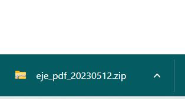

# Betha Team - Gestión y Conversión de Archivos en Línea

Breve descripción:

Betha Team es una aplicación web que ofrece una solución integral para la administración y conversión de archivos en línea. La plataforma está diseñada para abordar la problemática del extravío de documentos importantes, proporcionando a los usuarios una forma segura y organizada de almacenar y gestionar sus archivos en la nube.

## Capturas de pantalla
- Inicio:
  

- Inicio de sesión:
  

- Registro:
  

- Acerca de:
  

- Conversor:
  
  
  

- Descargas:
  

## Requerimientos e Instalación

Antes de ejecutar la aplicación, asegúrate de tener instalados los siguientes componentes:

  Python 3.7 o superior
  Flask
  SQLAlchemy
  Flask-Login
  Flask-WTF
  Pillow
  PyPDF2
  PyMuPDF
  Flask-Migrate
  Flask-Moment
  Y más.................

Para instalar el programa, sigue estos pasos:

1. Clona el repositorio en tu máquina local: `git clone https://github.com/tuusuario/turepositorio.git`
2. Accede al directorio del proyecto: `cd turepositorio`
3. Instala las dependencias del proyecto: `pip install -r requirements.txt`
4. Configura las variables de entorno y ajusta la configuración según sea necesario.
5. Ejecuta la aplicación: `python app.py`

## Uso

Una vez que la aplicación esté en funcionamiento, podrás realizar las siguientes acciones:

- Iniciar sesión con tu cuenta existente o registrarte para crear una nueva cuenta.
- Navegar por la plataforma y acceder a todas las funcionalidades disponibles.
- Cargar archivos a la plataforma y organizarlos en categorías y etiquetas.
- Utilizar las herramientas de búsqueda, categorización y descarga para administrar tus archivos de manera eficiente.
- Convertir archivos a diferentes formatos según tus necesidades.
- Compartir archivos con otros usuarios y colaborar en proyectos.
- Mantener la seguridad y privacidad de tus datos mediante sistemas de autenticación y encriptación.

## Autor

Equipo de BETHA TEAM

