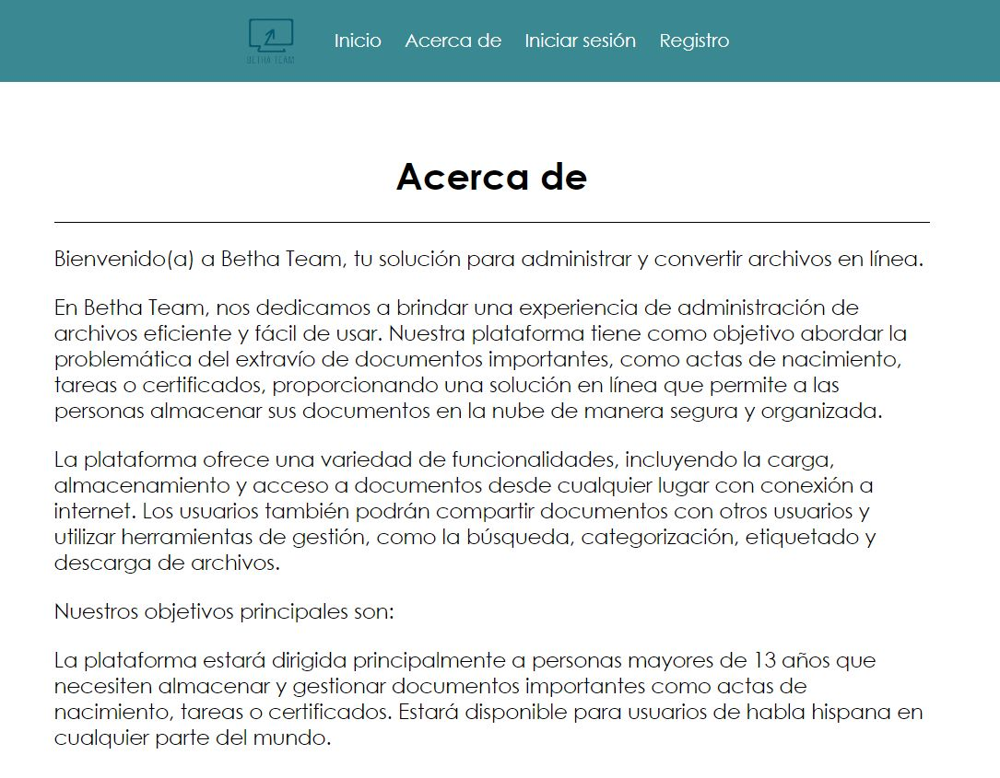

# Betha Team - Gestión y Conversión de Archivos en Línea

Breve descripción:

Betha Team es una aplicación web que ofrece una solución integral para la administración y conversión de archivos en línea. La plataforma está diseñada para abordar la problemática del extravío de documentos importantes, proporcionando a los usuarios una forma segura y organizada de almacenar y gestionar sus archivos en la nube.

## Capturas de pantalla
- Inicio:
  

- Inicio de sesión:
  

- Registro:
  

- Acerca de:
  

- Conversor:
  
  
  

- Almacenamiento - Base de datos:
  
  
  
  
  
  - Archivos:
  
  
  

  - Archivos:
  
  
  
## Requerimientos e Instalación

Antes de ejecutar la aplicación, asegúrate de tener instalados los siguientes componentes:

  - Python 3.7 o superior
  - Flask
  - hashlib
  - shutil
  - flask
  - werkzeug
  - PIL (Image)
  - pytesseract
  - pdf2image
  - os
  - zipfile
  - io
  - fitz
  - docx
  - firebase_admin
  - datetime
  - uuid

## Uso

Una vez que la aplicación esté en funcionamiento, podrás realizar las siguientes acciones:

- Iniciar sesión con tu cuenta existente o registrarte para crear una nueva cuenta.
- Navegar por la plataforma y acceder a todas las funcionalidades disponibles.
- Cargar archivos a la plataforma.
- Utilizar las herramientas de descarga para administrar tus archivos de manera eficiente.
- Convertir archivos a diferentes formatos según tus necesidades.
- Mantener la seguridad y privacidad de tus datos mediante sistemas de autenticación y encriptación.
- Acceder a la página de archivos para ver la lista de tus archivos y descargarlos según sea necesario.

## Autor

Equipo de BETHA TEAM

